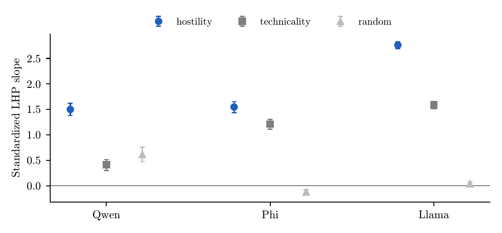

# Affect Under Constraint

Code, specifications and results for a series of preregistered activation-steering studies on whether an instruction removes the influence of a conflicting affect-associated representation in a language model, or only masks its expression.

**Paper:** Su, A. (2026). *Affect Under Constraint: Persistence of a Steered Affective Representation in Instruction-Tuned Language Models.* Preprint. [doi:10.5281/zenodo.23182205](https://doi.org/10.5281/zenodo.23182205)

## Summary

A hostility direction, extracted by a generation-based difference-of-means procedure, was added to the residual stream at mid-depth while the model was either unconstrained or instructed to be "unfailingly warm." Non-affective (technical-register) and random directions of matched norm served as controls.

- **Persistence.** Across Qwen2.5-3B-Instruct, Phi-3.5-mini-instruct and Llama-3.2-3B-Instruct, hostility steering still increased the models' preference for hostile reply openers under the warmth instruction, more than either control, meeting the preregistered criterion for generality.
- **Dissociation.** In two of three models, expressed hostility rose more slowly than this latent preference.
- **Carryover.** A predicted hostility-specific effect of the steered hidden state on a later judgment was not supported.



*Figure 1. Dose–response slopes of latent hostile-opener preference (LHP) under the warmth instruction, with 97.5% prompt-cluster bootstrap intervals.*

## Records

| What | DOI |
|---|---|
| Preprint (all versions) | [10.5281/zenodo.23182205](https://doi.org/10.5281/zenodo.23182205) |
| Study 1 preregistration (v2.3) | [10.5281/zenodo.23140443](https://doi.org/10.5281/zenodo.23140443) |
| Study 2 preregistration (v3.1) | [10.5281/zenodo.23147672](https://doi.org/10.5281/zenodo.23147672) |
| Full code and data, including raw generations | [10.5281/zenodo.23181324](https://doi.org/10.5281/zenodo.23181324) |
| Study 3 preregistration (in progress) | [10.5281/zenodo.23247883](https://doi.org/10.5281/zenodo.23247883) |

The Zenodo records are the archival versions. This repository mirrors the code, specifications and results for browsing; raw main-run generations (about 30 MB) are on Zenodo only.

## Layout

```
study1/   Study 1 (Qwen2.5-3B-Instruct; Gemma-2-2B-it failed its manipulation check)
study2/   Study 2 (Qwen2.5-3B-Instruct, Phi-3.5-mini-instruct, Llama-3.2-3B-Instruct)
figures/  Figures from the paper
```

Within each study folder:

- `PREREG.md`, `config.yaml` — frozen specification and every parameter.
- `PREREG_APPROVED` — the author's approval, with SHA-256 hashes of the frozen files.
- `AGENTS.md` — the rules given to the AI coding agent that implemented and ran the study.
- `DEVIATIONS.md` — complete log of departures from the plan.
- `src/` — all code. Study 2's frozen analysis is `src/analyze.py` (hash in `results/analysis_frozen.sha256`).
- `prompts/` — extraction scenarios, test and calibration prompts, openers, lexicon, rating question.
- `data/directions/` — steering directions (`.pt`) and mean residual norms; `data/calibration*` — write-once calibration files.
- `results/` — frozen analysis outputs (`analysis.json`, `report.md`), stage reports, integrity checks, synthetic-data validation.
- `study2/results/exploratory/` — the exploratory (not preregistered) sensitivity analysis.

## Reproducing the Study 2 analysis

1. Download the three `study2_raw_*.zip` archives from [Zenodo](https://doi.org/10.5281/zenodo.23181324) and unzip them into `study2/data/raw/`.
2. From `study2/`, with Python 3.12, `numpy` and `pyyaml`:

```
python -m src.analyze --input data/raw/*_main.jsonl --output results/analysis_rerun.json
```

The exploratory sensitivity analysis can be re-run with `python3 results/exploratory/sensitivity_p1_lhp_gate.py`. Re-running the generation stages requires the model weights from Hugging Face and the package versions listed in `env.txt`; the studies were run on an Apple-silicon Mac in bfloat16.

## Citation

See `CITATION.cff`, or cite the preprint DOI above.

## License

Code: MIT (see `LICENSE`). Data, prompts, figures and documents: CC BY 4.0.

Arthur Su · ORCID [0009-0002-5678-4708](https://orcid.org/0009-0002-5678-4708) · Part of the [Computational Psychodynamics](https://zenodo.org/communities/computational-psychodynamics) series
